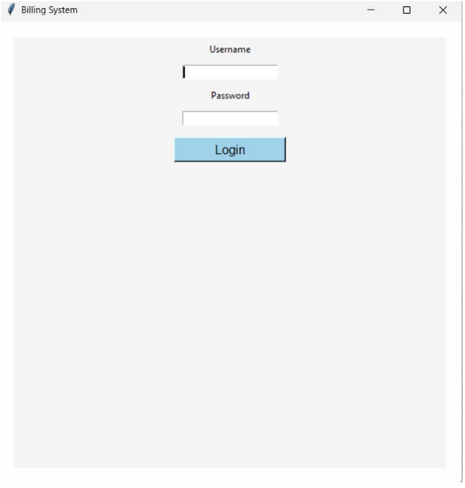

# 🧾 Billing System (Python Tkinter + MySQL)

## 📌 Overview
A GUI-based billing system developed using Python (Tkinter) with MySQL database integration. The application enables efficient product management, secure login, and automated bill generation.

## 🚀 Features
- 🔐 User Authentication System
- 📦 Product Management (Add, Update, Delete)
- 🧾 Bill Generation
- 🔄 Real-time Database Connectivity

## 🛠️ Tech Stack
- Python (Tkinter)
- MySQL
- MySQL Connector

## ⚙️ How to Run
1. Install Python
2. Install MySQL
3. Install dependency:
   pip install mysql-connector-python
4. Configure database in the code
5. Run main.py

## 📸 Output
## 📸 Output

